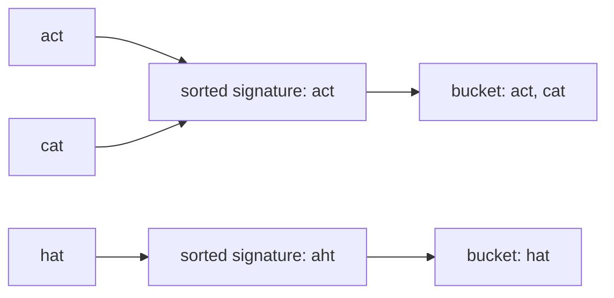

# Group Anagrams Reconstruction Card

[NeetCode problem](https://neetcode.io/problems/anagram-groups/question?list=neetcode150)

## Rebuild chain

Partition strings by anagram equivalence → assign equal strings-under-reordering the same canonical signature → signature-to-bucket map → every input enters exactly one bucket → return buckets in any order.

## Recognition

- **Decisive clue:** grouping by a relation suggests “key each item by the property that defines its group.”
- **Canonical choice here:** sorted characters cost O(L log L) per word and directly provide a stable string key; a 26-count signature is the O(L) alternative.
- **Ordering contract:** neither group order nor output order matters, so hash-map iteration is valid.

## State and invariant

- A sorted-string signature captures exactly the multiplicity of every character in a word.
- The map owns one list per signature.
- After processing any prefix, each word is in exactly one bucket, and two words share a bucket iff their signatures match.

## Reconstruction recipe

1. Create a map from canonical signature to a list of original strings.
2. For each string, sort a copy of its characters and use the resulting string as its signature.
3. Create the signature's bucket if absent, then append the original string.
4. Return all map buckets.

## Worked transition

`pots`, `tops`, and `stop` all produce the same sorted signature `opst`, so they accumulate in one bucket; `hat` produces `aht` and opens another.

Boundary: the empty string has a valid all-zero signature and forms a normal bucket; duplicate input strings remain duplicate entries in that bucket.

## Recall drill

### What property must a grouping key have?

Reveal

It must be identical for all anagrams and different for any pair with different character counts.

### What does the fixed-alphabet alternative change?

Reveal

It replaces each O(L log L) sort with an O(L) pass that builds a stable 26-count signature.

## Trap and cost

- **Trap:** using the raw mutable character array as a map key may compare identity instead of contents; convert the sorted characters into a stable value key.
- **Time:** O(M · L log L) from sorting each of M strings of maximum length L.
- **Space:** O(total input characters) for buckets and stored signatures, excluding returned references as appropriate.
