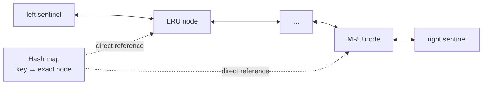
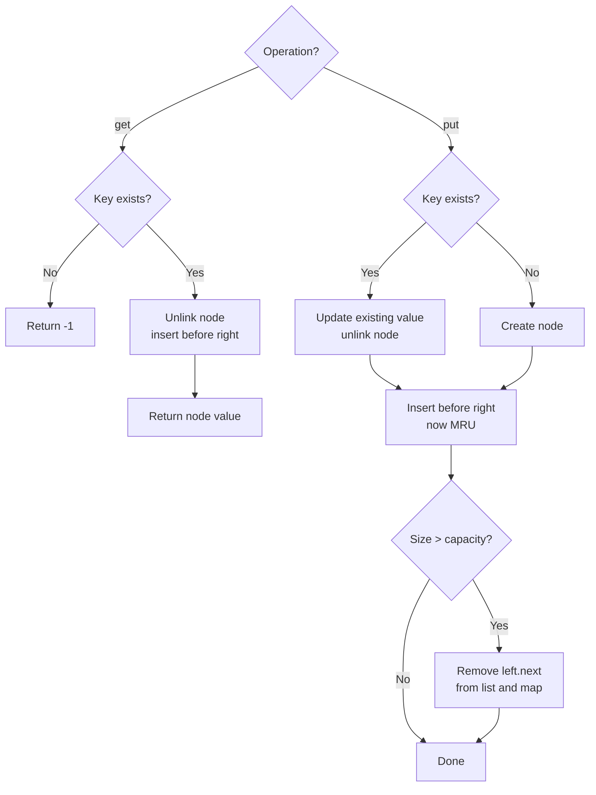

# LRU Cache Reconstruction Card

[NeetCode problem](https://neetcode.io/problems/lru-cache/question?list=neetcode150)

## Rebuild chain

Recent-use eviction + O(1) average `get` and `put` → identify keys instantly and reorder known entries instantly → hash map + doubly linked list → map and list always describe the same cache → promote on every hit, evict from the LRU end.

## Recognition

- **Decisive clues:** reads, inserts, and updates all count as use; exceeding capacity evicts the least recently used key; each operation must average O(1).
- **Constraint pressure:** as many as `2 * 10^5` operations makes an O(n) scan or shift on each access too expensive.
- **Why the obvious structures fall short:** a map finds a key but does not maintain recency; an array or ordinary list maintains order but needs O(n) to find or remove an arbitrary key.
- **Required operations:** lookup a node, unlink that exact node, append it at the MRU end, and remove the LRU node—all in O(1).

## State and invariant

- The map sends each cached key to its one exact list node.
- Real nodes are ordered from least recently used to most recently used between two sentinels.
- `left.next` is always the LRU node; `right.prev` is always the MRU node.
- After every public operation, the map and list contain exactly the same real nodes and their count is at most `capacity`.

The map supplies identity; the list supplies order. Neither duplicates the other's job.

## Operation flow

## Reconstruction recipe

1. Create a map and empty doubly linked list bounded by `left` and `right` sentinels.
2. Write an unlink operation that reconnects a node's neighbors and removes its map entry.
3. Write an MRU insertion operation that places a node immediately before `right` and records it in the map.
4. For `get`, return `-1` on a miss; on a hit, unlink and reinsert the same node before returning its value.
5. For `put`, update and promote an existing node, or create and insert a new one.
6. After insertion, if the cache is oversized, evict `left.next`.

The sentinels make insertion and removal use the same pointer operations for empty, single-node, LRU, and MRU cases.

## Worked transition

For capacity `2`, write the list from LRU to MRU:

| Operation | Order after operation | Result |
|---|---|---|
| `put(1, 10)` | `1` | insert 1 |
| `put(2, 20)` | `1, 2` | 2 is MRU |
| `get(1)` | `2, 1` | return 10; 1 becomes MRU |
| `put(3, 30)` | `1, 3` | evict 2 |
| `get(2)` | `1, 3` | return -1; misses do not change order |

Boundary: with capacity `1`, inserting a different key always evicts the only existing real node; the sentinels remain untouched.

## Recall drill

### 1. Which required operations force a combination of structures?

Reveal

Find a key directly, remove a known entry directly, maintain recency order, and remove the oldest entry directly. A map provides identity; a doubly linked list provides O(1) reordering and eviction once the map supplies the node.

### 2. What must remain true after every operation?

Reveal

The map and list contain the same real nodes, ordered LRU to MRU, with `left.next` oldest, `right.prev` newest, and no more than `capacity` nodes.

### 3. How does a successful read change the state?

Reveal

Unlink the found node and insert that same node at the MRU end. Its value is returned; cache size is unchanged.

### 4. What are the two write branches?

Reveal

For an existing key, update its value and promote its node. For a new key, create and insert a node, then evict the LRU node if capacity was exceeded.

### 5. Can you derive the helpers before writing `get` and `put`?

Reveal

Unlink reconnects `prev` and `next`; insert-MRU connects the old MRU, the node, and `right`. Keep the matching map entry synchronized with each helper.

## Trap and cost

- **Trap:** reusing an existing node during `put` requires changing its value as well as its position. Promotion alone leaves stale data in the cache.
- **Time:** O(1) average per `get` and `put`: one hash lookup plus a constant number of map and pointer updates.
- **Space:** O(capacity): at most one map entry and one linked node per cached key, plus two sentinels.
