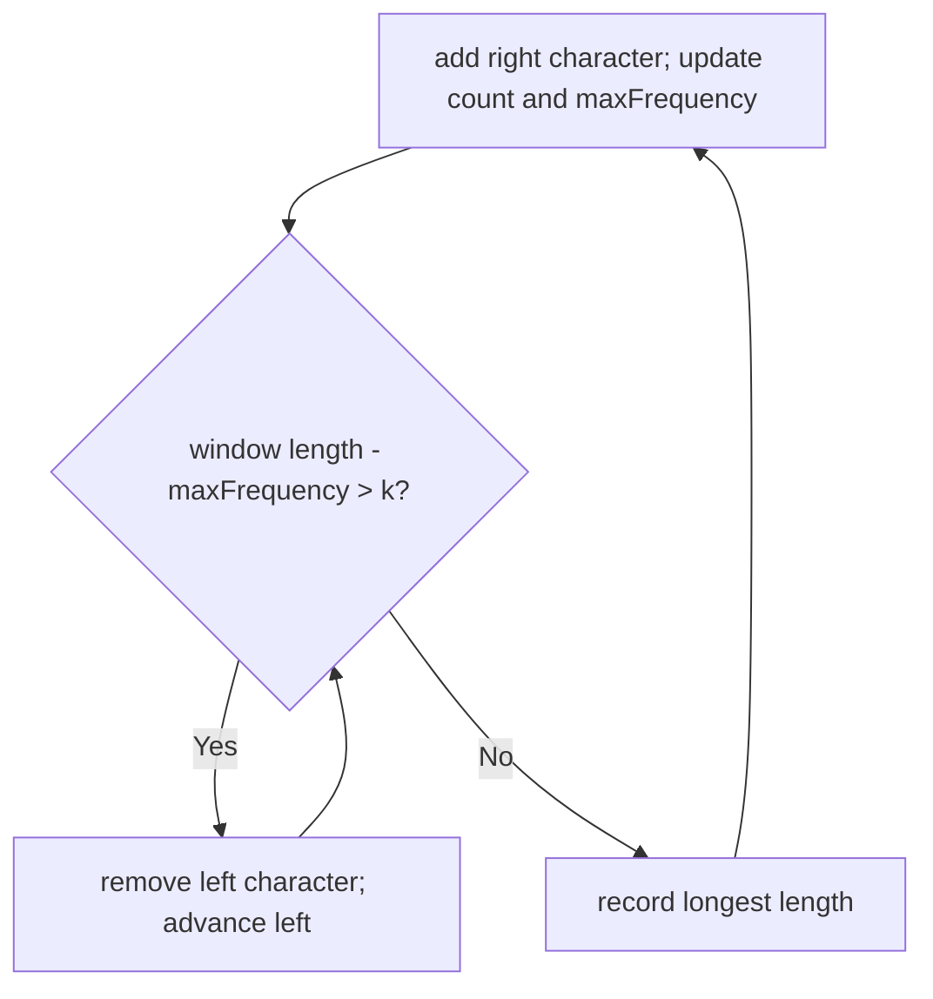

# Longest Repeating Character Replacement Reconstruction Card

[NeetCode problem](https://neetcode.io/problems/longest-repeating-substring-with-replacement/question?list=neetcode150)

## Rebuild chain

Make one substring uniform with at most `k` changes → exact replacements = length − current maximum frequency → count letters in a sliding window → retain a historical maximum to track the best length → shrink when length − historical maximum exceeds `k`.

## Recognition

- **Decisive equation:** for any window, the cheapest target is its most frequent character, so required replacements equal all other positions.
- **Constraint pressure:** 100,000 characters require a monotonic window rather than inspecting every substring.
- **Alphabet:** uppercase English letters permit a fixed 26-counter array.

## State and invariant

- The counters represent character frequencies in the current window.
- `maxFrequency` is the greatest single-character frequency observed while expanding; it may become stale after left moves.
- After shrinking, `length - maxFrequency ≤ k`, but the historical maximum may exceed the current maximum: the maintained window need not be valid.
- Why the best length is sound: until the first shrink, the maximum is exact. A shrink keeps the previous length, which has reached `maxFrequency + k`. Growing beyond it requires a new higher frequency actually occurring in the window; that larger length is therefore valid. A stale maximum can retain an invalid window of the same length, but cannot create a new record.

## Reconstruction recipe

1. Maintain a left boundary, 26 character counts, a nondecreasing maximum frequency, and the best length.
2. For each new right character, increment its count and update the maximum frequency.
3. While `window length - historical maximum > k`, decrement the outgoing left character and advance left; keep the historical maximum unchanged.
4. Record the largest resulting length. Return that length; these bounds are not guaranteed to identify a valid substring.

## Worked transition

For `AAABABB`, `k=1`, window `AAABA` has length `5` and maximum frequency `4`, so one replacement makes it uniform. Adding the next `B` makes `6 - 4 > 1`, so remove the first `A`. The retained window `AABAB` has counts `A:3, B:2`: it actually needs two replacements, but `5 - 4 ≤ 1` using the historical maximum. The best stays `5`, justified by the earlier valid `AAABA`.

Boundary: for `AAB`, `k=0`, the valid run `AA` establishes best length `2`. Adding `B` removes the first `A` and leaves `AB`, with current maximum `1` and historical maximum `2`. The retained window is invalid, but the returned length `2` is still correct.

## Recall drill

### How do you calculate the fewest replacements needed for a particular window?

Reveal

Subtract the actual highest character frequency from the window length. Keeping that largest existing group minimizes the number of positions that must be replaced.

### What does the saved maximum tell you after the left boundary moves, and what does it no longer guarantee?

Reveal

It remembers a frequency reached during expansion, not necessarily the current window's maximum. After a shrink, the retained length is already justified by an earlier valid window. A new length record requires an actual higher frequency; the current bounds themselves need not describe a valid substring.

### Rebuild the full algorithm and justify its costs.

Reveal

Track exact window counts, a historical maximum, left, and best. Extend right and raise the historical maximum when warranted. Shrink while length minus that maximum exceeds k, then record the largest length. New records are valid even though retained bounds may be stale. Monotonic boundaries give O(n) time; 26 counters use O(1) space.

## Trap and cost

- **Trap:** treating the historical maximum as an exact validity check confuses a retained window with a valid answer substring. Keeping it unchanged is sufficient for the length answer; recomputing over 26 counters is also O(n) overall, just with additional constant work.
- **Time:** O(n), because both boundaries move only forward and counter updates are constant time.
- **Space:** O(1) for 26 counters.
