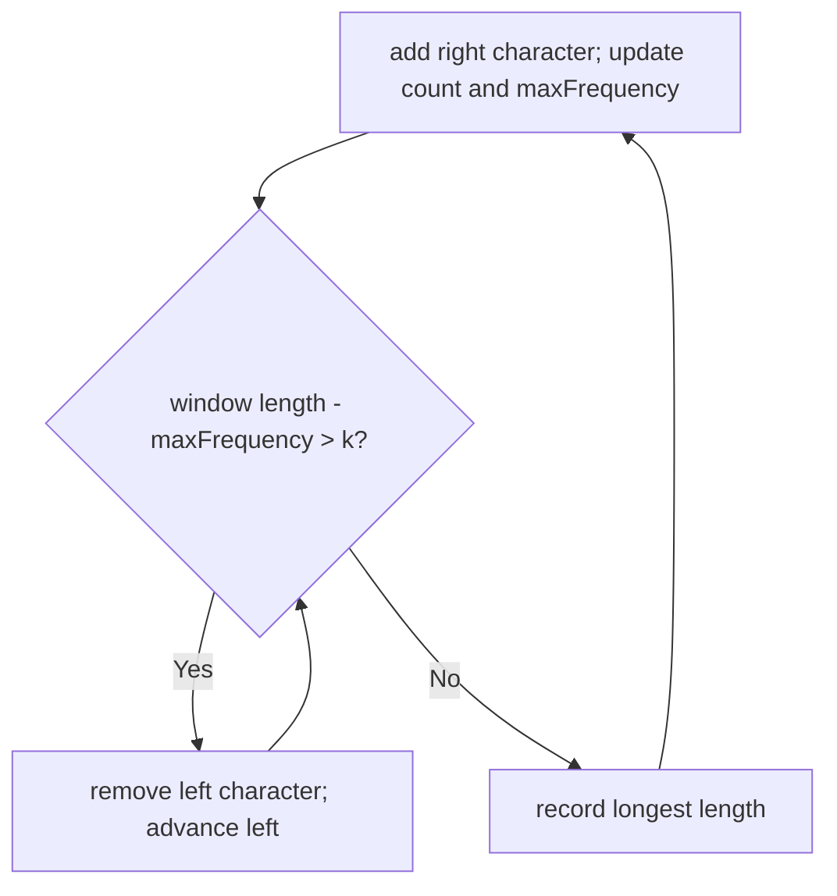

# Longest Repeating Character Replacement Reconstruction Card

[NeetCode problem](https://neetcode.io/problems/longest-repeating-substring-with-replacement/question?list=neetcode150)

## Rebuild chain

Make one substring uniform with at most `k` changes → keep its most frequent character, replace all others → replacements = window length − maximum frequency → sliding window shrinks only when that exceeds `k`.

## Recognition

- **Decisive equation:** for any window, the cheapest target is its most frequent character, so required replacements equal all other positions.
- **Constraint pressure:** 100,000 characters require a monotonic window rather than inspecting every substring.
- **Alphabet:** uppercase English letters permit a fixed 26-counter array.

## State and invariant

- The counters represent character frequencies in the current window.
- `maxFrequency` is the greatest single-character frequency observed while expanding; it may become stale after left moves.
- A window is shrunk while `length - maxFrequency > k`; a stale maximum may delay shrinking, but cannot create a better recorded length than a window size previously justified by that maximum.

## Reconstruction recipe

1. Maintain a left boundary, 26 character counts, a nondecreasing maximum frequency, and the best length.
2. For each new right character, increment its count and update the maximum frequency.
3. While the window would require more than `k` replacements, decrement the outgoing left character and advance left.
4. Record the largest resulting window length.

## Worked transition

For `AAABABB`, `k=1`, window `AAABA` has length `5` and maximum frequency `4`, so one replacement makes it uniform. Extending further eventually forces left to move, but the best remains `5`.

Boundary: with `k=0`, the condition allows only runs already made of one character.

## Recall drill

### Why target the most frequent character in a window?

Reveal

Keeping the largest existing group minimizes the number of positions that must be replaced.

### Why need the maximum frequency not decrease during shrinking?

Reveal

The algorithm only seeks a larger length. A historical maximum certifies the size threshold that was achievable; stale state may retain a window but cannot invent a new larger threshold without a matching frequency occurring during expansion.

## Trap and cost

- **Trap:** recomputing the maximum on every shrink adds work; the nondecreasing historical maximum is sufficient for the final maximum-length answer.
- **Time:** O(n), because both boundaries move only forward and counter updates are constant time.
- **Space:** O(1) for 26 counters.
