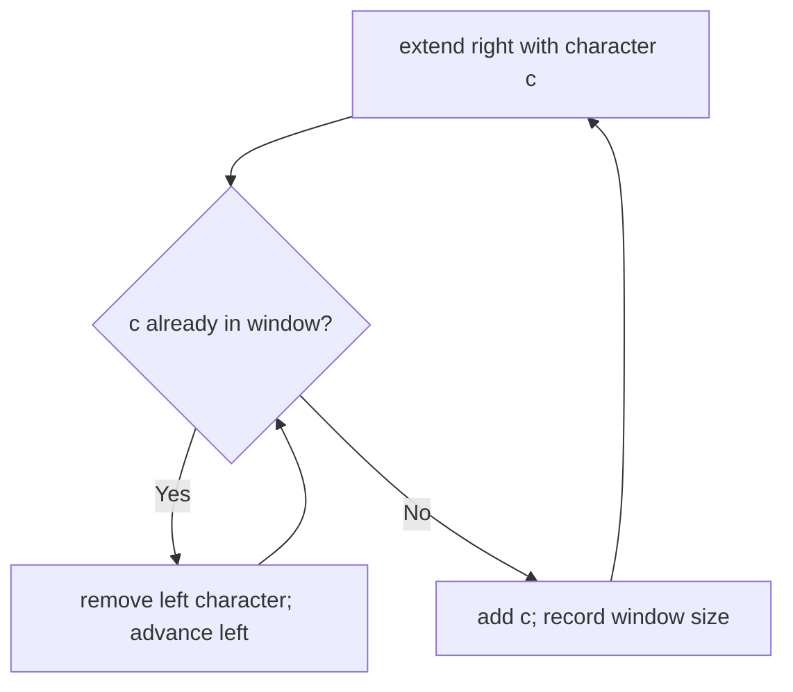

# Longest Substring Without Repeating Characters Reconstruction Card

[NeetCode problem](https://neetcode.io/problems/longest-substring-without-duplicates/question?list=neetcode150)

## Rebuild chain

Longest contiguous all-distinct region + up to 50,000 characters → sliding window → set mirrors current window → on collision, remove from the left only until the duplicate disappears → record maximum valid size.

## Recognition

- **Decisive clues:** “substring” means contiguous, and “without duplicate” is a validity condition that can be repaired by shrinking one boundary.
- **Constraint pressure:** restarting a scan at every left endpoint repeats work and can be O(n²).
- **Required operations:** test whether the entering character is in the window and remove characters that leave it.

## State and invariant

- Before extending again, the set contains exactly the characters in `[left, right]` and that window has no duplicates.
- When the next character collides, advancing left and deleting along the way preserves contiguity and removes only the minimum necessary prefix.
- Both boundaries move monotonically, so every character enters and leaves at most once.

## Reconstruction recipe

1. Start an empty character set, a left boundary at zero, and a best length of zero.
2. Extend the right boundary one character at a time.
3. While the entering character is already present, delete the leftmost window character and advance left.
4. Add the entering character and update the best from the valid window length.

## Worked transition

For `dvdf`, the window grows to `dv`. The next `d` collides: remove only the old `d`, retain `v`, and add the new `d` to obtain `vd`. Adding `f` then gives `vdf`, length `3`. Clearing the whole window at the collision would lose `v` and finish with a best length of only `2`.

Boundary: an empty string never opens a window and returns `0`; repeated one-character input keeps repairing to length `1`.

## Recall drill

### When a repeated character arrives, what part of the current substring can you keep?

Reveal

Only the prefix through the previous copy of the entering character is invalid; the remaining suffix can participate in a longer future window.

### What makes the while-loop linear overall?

Reveal

The left boundary never moves backward, so its total number of advances is at most n.

### Rebuild the full algorithm and justify its costs.

Reveal

Start an empty set, left at zero, and best at zero. For each entering character, remove from the left until its earlier copy is gone; then insert it and record the length. The set exactly represents a distinct window. Each character enters and leaves at most once: O(n) time and O(k) space for distinct window characters.

## Trap and cost

- **Trap:** rebuilding the entire window on any duplicate discards a valid suffix and can miss the optimum.
- **Time:** O(n), because each character is added and removed at most once.
- **Space:** O(k), where k is the number of distinct characters in the largest maintained window/alphabet.
