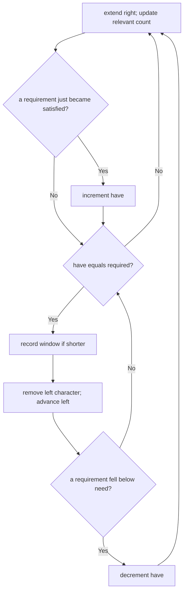

# Minimum Window Substring Reconstruction Card

[NeetCode problem](https://neetcode.io/problems/minimum-window-with-characters/question?list=neetcode150)

## Rebuild chain

Shortest substring covering all target multiplicities + up to 100,000 characters → frequency maps avoid rescanning → expand right until all distinct requirements are satisfied → shrink left while valid → remember the shortest valid bounds.

## Recognition

- **Decisive clues:** “substring” requires contiguity, “shortest” requires contracting valid candidates, and duplicates in the target require counts rather than membership.
- **Constraint pressure:** enumerating or revalidating all substrings is quadratic; two monotonic boundaries make the scan linear.
- **Validity summary:** track how many distinct required characters currently meet or exceed their required count.

## State and invariant

- `need[c]` is the required multiplicity of each target character.
- `window[c]` counts only relevant characters inside `[left, right]`.
- `have` is the number of distinct target characters whose window count is at least their need; the window is valid exactly when `have == number of needed keys`.
- The saved bounds are the shortest valid window seen before each necessary invalidation.

## Reconstruction recipe

1. Return empty when the target is empty or longer than the source.
2. Build target frequencies and set `required` to the number of distinct target characters.
3. Expand the right boundary; when a relevant count reaches its need exactly, increase `have`.
4. While all requirements are satisfied, save the window if it is the shortest, then remove the left character and advance left.
5. If removal drops a relevant count below its need, decrease `have` and resume expansion.
6. Return the saved slice, or empty if none was saved.

## Worked transition

For `s = OUZODYXAZV`, `t = XYZ`, expansion first satisfies all three at `OUZODYX`. Shrinking removes irrelevant prefix characters until `ZODYX`; later expansion and contraction finds the shorter valid window `YXAZ`.

Boundary with duplicates: for `s = AAAB`, `t = AAB`, the requirements are `A:2, B:1`, so `required = 2`.

| Transition | Window counts | `have` | Effect |
|---|---|---|---|
| First `A` enters | A:1 | 0 | A still below need |
| Second `A` enters | A:2 | 1 | A reaches need |
| Third `A` enters | A:3 | 1 | Surplus A adds no requirement |
| `B` enters | A:3, B:1 | 2 | Save valid `AAAB` |
| First `A` leaves | A:2, B:1 | 2 | Still valid; save shorter `AAB` |
| Second `A` leaves | A:1, B:1 | 1 | A falls below need; stop shrinking |

Return the saved `AAB`, not the invalid remaining `AB`.

## Recall drill

### How can you summarize whether all target multiplicities are covered without rescanning the counts?

Reveal

Track one satisfied requirement per distinct target character, with multiplicities stored in `need`. The window is valid when the satisfied count equals the number of distinct target characters.

### At which exact count transitions does `have` change?

Reveal

Increase when a count reaches its requirement; decrease when removal makes it fall below the requirement.

### Rebuild the full algorithm and justify its costs.

Reveal

Count target multiplicities and track satisfied distinct requirements. Expand right until all are met; while valid, save shorter bounds and remove from the left, decreasing satisfaction only when a count falls below need. Return the saved slice or empty if none. Both boundaries advance monotonically: O(|s| + |t|) time and O(k) counting state for k distinct target characters.

## Trap and cost

- **Trap:** incrementing `have` for every matched occurrence overcounts duplicate target characters and corrupts the shrink condition.
- **Time:** O(|s| + |t|), because both source boundaries move only forward and the target is counted once.
- **Space:** O(k), where k is the number of distinct target characters.
