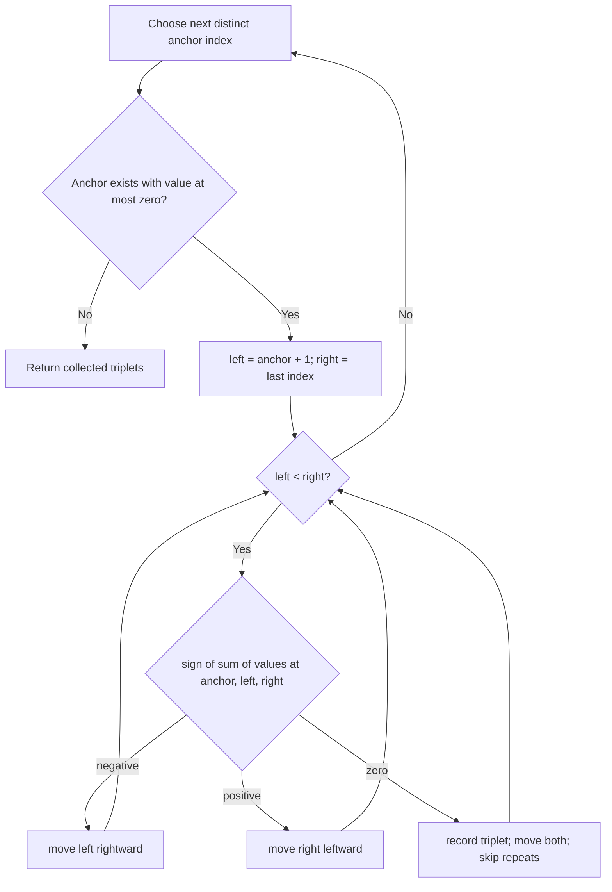

# 3Sum Reconstruction Card

[NeetCode problem](https://neetcode.io/problems/three-integer-sum/question?list=neetcode150)

## Rebuild chain

All distinct zero-sum triplets + `n` up to 3,000 → O(n³) is too costly → sort → fix one anchor and solve two-sum on its right with two pointers → skip repeated anchors and inner values → O(n²).

## Recognition

- **Pattern:** this is sorted two-sum repeated once per possible anchor.
- **Constraint pressure:** O(n²) fits where enumerating every triple does not.
- **Duplicate contract:** uniqueness is about value triplets, so equal adjacent sorted values must not start equivalent searches or repeat a found pair.

## State and invariant

- For a fixed anchor, the unresolved pair lies between the two inner pointers.
- A negative total requires a larger left value; a positive total requires a smaller right value.
- Skipping an anchor equal to the previous anchor and repeated inner values after a hit emits each value triplet once.

## Reconstruction recipe

1. Sort the values.
2. Visit anchors from left to right, skipping an anchor equal to its predecessor; stop once the anchor is positive.
3. Search the suffix with pointers at its ends.
4. Move the appropriate pointer according to the total's sign.
5. On zero, record the triplet, move both pointers, and pass repeated inner values before continuing.

## Worked transition

Sorted `[-1,0,1,2,-1,-4]` becomes `[-4,-1,-1,0,1,2]`. Anchor `-1` finds `[-1,-1,2]`, then `[-1,0,1]`; the second `-1` anchor is skipped.

Boundary: `[0,0,0,0]` records `[0,0,0]` once, then duplicate skipping exhausts the window.

## Recall drill

### How can you reduce triplet search to a familiar problem?

Reveal

Sort, fix one anchor, then find two values in its sorted suffix whose sum is the negation of that anchor. This is the sorted two-sum pattern.

### Where must duplicate control happen?

Reveal

At the anchor level and after recording an inner pair; otherwise equivalent value choices emit the same triplet.

### Rebuild the full algorithm and justify its costs.

Reveal

Sort, visit each distinct nonpositive anchor, and solve sorted two-sum on its suffix. Move the appropriate endpoint by the total's sign; on zero, record the triplet, move both endpoints, and skip repeated inner values. Pruning preserves possible pairs; duplicate control emits each triplet once. At most n linear sweeps give O(n²) time and constant pointer state, excluding output and sort storage.

## Trap and cost

- **Trap:** deduplicating only anchors but not inner values lets repeated triplets leak through after a hit.
- **Time:** O(n²): sorting is O(n log n), followed by up to n linear two-pointer sweeps.
- **Space:** O(1) auxiliary space excluding output and the sorting implementation's stack/storage.
