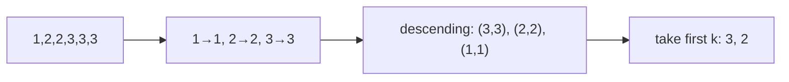

# Top K Frequent Elements Reconstruction Card

[NeetCode problem](https://neetcode.io/problems/top-k-elements-in-list/question?list=neetcode150)

## Rebuild chain

Top `k` by frequency + answer unique → count first → order distinct `(value, count)` pairs by descending count → take the first `k` → return their values in any order.

## Recognition

- **Decisive clue:** selection depends on aggregate frequency, so raw values must first be reduced to `(value, count)` pairs.
- **Current selection strategy:** sorting all `m` distinct entries costs O(m log m), acceptable at the local problem scale and simple to reconstruct.
- **Linear alternative:** because no frequency exceeds `n`, bucket values by frequency and scan from `n` downward; a size-`k` min-heap is another O(n + m log k) option.

## State and invariant

- The frequency map is the exact count of every distinct value.
- After descending sort, each entry's count is at least the count of every entry to its right.
- Therefore the first `k` keys are exactly the `k` most frequent values; uniqueness of the answer removes cutoff ties.

## Reconstruction recipe

1. Count each value in a hash map.
2. Treat the map entries as `(value, frequency)` pairs.
3. Sort the pairs by descending frequency.
4. Take the first `k` pairs and return their values.

## Worked transition

For `[1,2,2,3,3,3]`, the sorted entries are `(3,3), (2,2), (1,1)`. Taking the first two returns `[3,2]`; output order is permitted to vary.

Boundary: when `k` equals the number of distinct values, taking the sorted prefix collects every map key.

## Recall drill

### Why does taking a prefix of the sorted entries work?

Reveal

Descending order guarantees that no unselected entry is more frequent than a selected one.

### When would a heap be the better reconstruction?

Reveal

When `k` is small or `n + 1` buckets are undesirable; retain only the best `k` counted entries.

## Trap and cost

- **Trap:** subtraction-based comparators can overflow in a sorting/heap variant; compare counts safely.
- **Time:** O(n + m log m), where `m` is the number of distinct values; counting is linear and sorting dominates selection.
- **Space:** O(m) for the frequency map and entry ordering, apart from the returned array.
