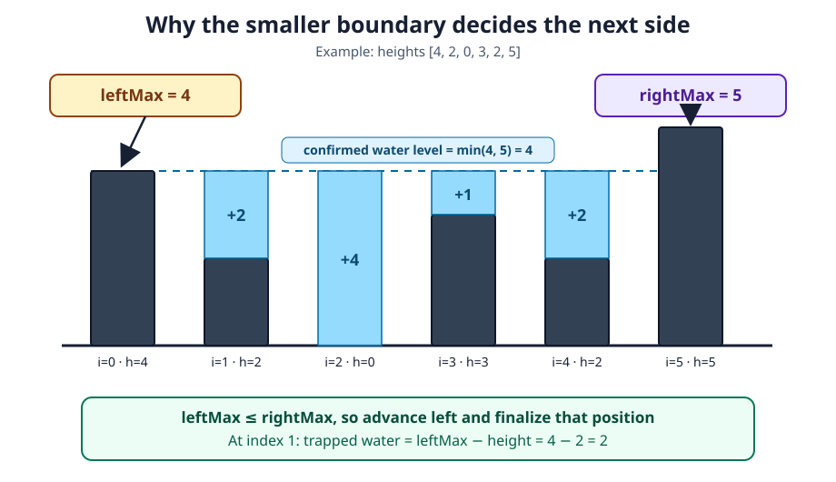

# Trapping Rain Water Reconstruction Card

[NeetCode problem](https://neetcode.io/problems/trapping-rain-water/question?list=neetcode150)

## Rebuild chain

Water at a bar is `min(maxLeft, maxRight) - height` → avoid two auxiliary max arrays → maintain maxima from both ends → whichever maximum is smaller fixes that side's water now → advance that side and accumulate.

## Recognition

- **Decisive relation:** a position's water level is limited by the shorter of its tallest walls on either side.
- **Naive cost:** searching both sides for every position repeats work and becomes O(n²).
- **Space refinement:** prefix/suffix arrays give O(n) time; two pointers preserve the same information needed at the next unresolved endpoints in O(1) space.

## State and invariant

- `leftMax` and `rightMax` are the tallest walls seen from their respective ends.
- If `leftMax ≤ rightMax`, the right side already supplies a wall at least as high as `leftMax`. The next left bar traps `leftMax - height` if it is lower; a taller bar raises `leftMax` and traps zero.
- Symmetrically, a smaller `rightMax` fixes the next right position.

## Reconstruction recipe

1. Place pointers at both ends and initialize each side's running maximum from its endpoint.
2. Compare the two running maxima.
3. Advance the side with the smaller maximum.
4. Update that side's maximum, then add the difference between it and the new bar height.
5. Repeat until the pointers meet.

## Worked transition

In `[4,2,0,3,2,5]`, left maximum `4` is bounded by right maximum `5`, so left-side positions finalize as `2`, `4`, `1`, and `2` units, totaling `9`.

Boundary: in `[1,3,2]`, the initial maxima are `1` and `2`, so advance left onto height `3`. Update `leftMax` to `3` before adding `3 - 3 = 0`; adding with the old maximum would incorrectly contribute `1 - 3 = -2`. The total remains zero.

## Recall drill

### Which position can you finalize next using only the known boundaries, and why?

Reveal

Advance the side with the smaller known maximum; either side works on a tie. The opposite boundary is already high enough to enclose water up to that maximum. A lower new bar traps the difference; a taller one raises the maximum and contributes zero.

### In what order should a side's state be updated?

Reveal

Advance, update that side's maximum with the new height, then add `maximum - height` so the contribution cannot be negative.

### Rebuild the full algorithm and justify its costs.

Reveal

Initialize endpoint pointers and their maxima. While the pointers differ, advance the side with the smaller maximum, choosing either on a tie. Update that maximum before adding maximum minus height. The opposite boundary certifies the contribution, or a new maximum contributes zero. Each position is processed once, giving O(n) time and O(1) space.

## Trap and cost

- **Trap:** adding before updating the side maximum can create negative “water” when the new bar is taller.
- **Time:** O(n), because each pointer crosses the array once.
- **Space:** O(1).
